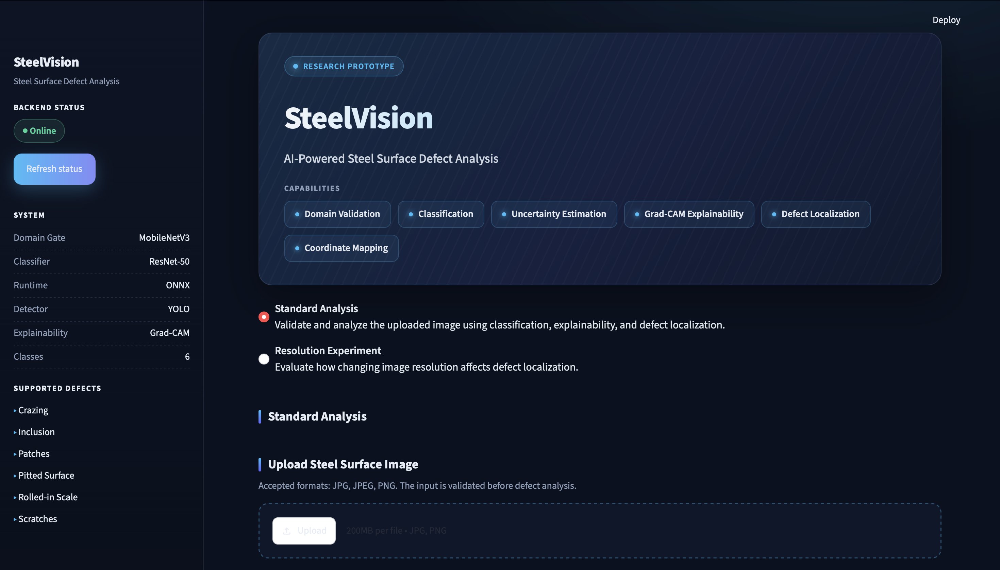

# SteelVision

**An end-to-end deep learning research system for steel surface defect analysis: it validates the input, classifies the defect, explains and quantifies its confidence, localizes it, and studies how image resolution affects all of it.**


<p align="center">
  
</p>

---

## Table of Contents

1. [Overview](#1-overview)
2. [Results at a Glance](#2-results-at-a-glance)
3. [System Architecture](#3-system-architecture)
4. [Quick Start](#4-quick-start)
5. [Dataset and Preprocessing](#5-dataset-and-preprocessing)
6. [Step 1: Classification](#6-step-1-classification)
7. [Step 2: Resolution Degradation](#7-step-2-resolution-degradation)
8. [Step 3: Super-Resolution](#8-step-3-super-resolution)
9. [Step 4: Defect Localization](#9-step-4-defect-localization)
10. [Step 5: Explainability and Uncertainty](#10-step-5-explainability-and-uncertainty)
11. [Step 6: Optimization with ONNX](#11-step-6-optimization-with-onnx)
12. [Step 7: Robustness](#12-step-7-robustness)
13. [Deployment: API and Interface](#13-deployment-api-and-interface)
14. [Key Findings](#14-key-findings)
15. [Limitations and Responsible Use](#15-limitations-and-responsible-use)
16. [Project Reference](#16-project-reference)
17. [Future Work](#17-future-work)

---

## 1. Overview

Steel surface inspection becomes harder when visual detail is lost to low image resolution. SteelVision started from one research question:

> **Does neural super-resolution improve downstream steel defect classification under degraded image resolution, compared with standard bicubic upscaling?**

(Short answer: no. See [Step 3](#8-step-3-super-resolution).)

Answering it properly meant building a full pipeline around the classifier. The project grew in stages:

| Stage | What was added | Why |
|---|---|---|
| Classification | Fine-tuned ResNet-50 | A strong baseline to test the research question against |
| Resolution study | Controlled degradation and Real-ESRGAN | The core research question |
| Localization | YOLO detector and coordinate mapping | Show *where* a defect is, not just *what* it is |
| Trust | Grad-CAM, SHAP, entropy | Make predictions interpretable and flag uncertain ones |
| Deployment | ONNX, FastAPI, Streamlit | Turn experiments into a usable application |
| Robustness | Cross-model agreement and a supported-domain gate | Handle model disagreement and unrelated inputs |

**Supported defect classes:**

```text
crazing · inclusion · patches · pitted_surface · rolled_in_scale · scratches
```

---

## 2. Results at a Glance

| Area | Result |
|---|---|
| Classification | **99.22%** test accuracy (253 / 255), fine-tuned ResNet-50 |
| Resolution impact | Accuracy falls from 99.61% (224 px) to 31.76% (32 px) |
| Super-resolution | Real-ESRGAN **underperformed** bicubic at every resolution |
| Localization | YOLO26n: mAP@50 = 0.801, ~6.9 ms per image |
| Calibration | Expected Calibration Error = 0.0482 |
| Inference speed | ONNX Runtime is **1.58×** faster than PyTorch on CPU |
| Model agreement | When YOLO detects, ResNet's class appears among its detections in **225 / 225** cases |
| Domain gate | 0 false accepts and 0 false rejects on the constructed test set at threshold 0.80 |

---

## 3. System Architecture

SteelVision combines four models, each with a distinct role:

| Model | Role |
|---|---|
| **MobileNetV3-Small** | Supported-domain validator: decides whether analysis should proceed |
| **ResNet-50 (fine-tuned)** | Primary image-level defect classifier |
| **YOLO26n** | Supporting localization: bounding boxes with per-region classes |
| **Grad-CAM** | Explains which regions influenced the ResNet prediction |

```text
                         Uploaded Image
                               │
                               ▼
                       Streamlit Frontend
                               │
                               ▼
                        FastAPI Backend
                               │
                               ▼
                    MobileNetV3-Small
                  Supported-Domain Gate
                               │
                  supported_probability
                               │
                     threshold = 0.80
                               │
               ┌───────────────┴───────────────┐
               │                               │
               ▼                               ▼
           Supported                        Rejected
               │                               │
               ▼                               ▼
       ONNX ResNet-50                    Stop Analysis
       Classification                     (HTTP 422)
               │
       ┌───────┼─────────┐
       │       │         │
       ▼       ▼         ▼
  Confidence Entropy  Grad-CAM
       │                 │
       └────────┬────────┘
                │
                ▼
               YOLO
        Defect Localization
                │
                ▼
     ResNet–YOLO Evidence Check
                │
       ┌────────┼────────┐
       │        │        │
       ▼        ▼        ▼
   Matching   No Box   Different
   Evidence   Found     Classes
       │
       ▼
  Coordinate Mapping
       │
       ▼
  Streamlit Visualization
```

### Two workflows

**Standard Analysis** is the normal workflow. Upload an image and the full pipeline above runs on it as provided. No resolution needs to be specified.

**Resolution Experiment** is a research workflow. It resizes the *same* uploaded image to a controlled resolution (`224`, `128`, `64`, or `32`) and compares detection count, detector confidence, and bounding boxes against the baseline. The chosen resolution is an experimental setting and does **not** estimate physical camera distance.

---

## 4. Quick Start

### 1. Clone and install

Developed with Python 3.13.

```bash
git clone https://github.com/vidhigadge/steelvision-dl.git
cd steelvision-dl

python3 -m venv .venv
source .venv/bin/activate        # Windows: .venv\Scripts\activate

python -m pip install --upgrade pip
pip install -r requirements.txt
```

### 2. Provide the model files

Trained weights are **not stored in the repository** (`*.pth`, `*.pt`, `*.onnx`, and `runs/` are git-ignored). Four files are needed:

| File | Needed for | How to obtain |
|---|---|---|
| `models/resnet50_finetune.pth` | Grad-CAM | Train with `src/training/train_resnet_finetune.py` |
| `models/resnet50_finetune.onnx` | `/predict` | `python -m src.optimization.export_onnx` (needs the `.pth`) |
| `models/domain_validator_mobilenet_v3_small.pth` | Domain validation | `python -m src.models.train_domain_validator` |
| `runs/detect/steel_defect_yolo/weights/best.pt` | Localization | Restore from your YOLO training run |

<details>
<summary><b>Recreate the domain-validation dataset</b></summary>

```bash
python -m src.data.prepare_domain_supported
python -m src.data.prepare_domain_unsupported
python -m src.data.prepare_mvtec_hard_negatives
```

The generated folders (`data/domain_sources/`, `data/domain_validation/`, `data/clean_metal_source/`) are excluded from Git. The preparation scripts are version-controlled and reproducible.

</details>

### 3. Run (two terminals)

```bash
# Terminal 1: FastAPI backend
uvicorn src.api.main:app --reload

# Terminal 2: Streamlit frontend
streamlit run src/ui/app.py
```

- Backend: `http://127.0.0.1:8000`
- Swagger docs: `http://127.0.0.1:8000/docs`
- Streamlit prints its local URL on startup.

---

## 5. Dataset and Preprocessing

The project uses **1677** steel surface defect images in six classes, split 70 / 15 / 15 with `random seed = 42`.

| Class | Train | Validation | Test | Total |
|---|---:|---:|---:|---:|
| Crazing | 206 | 44 | 45 | 295 |
| Inclusion | 210 | 45 | 45 | 300 |
| Patches | 189 | 40 | 42 | 271 |
| Pitted Surface | 182 | 39 | 40 | 261 |
| Rolled-in Scale | 210 | 45 | 45 | 300 |
| Scratches | 175 | 37 | 38 | 250 |
| **Total** | **1172** | **250** | **255** | **1677** |

**Preprocessing** is identical for training, evaluation, and deployment:

```text
grayscale → 3 channels → resize 224×224 → tensor → ImageNet normalization
mean = [0.485, 0.456, 0.406]     std = [0.229, 0.224, 0.225]
```

---

## 6. Step 1: Classification

Three models were trained in sequence, each building on the last.

| Model | Setup | Test accuracy |
|---|---|---:|
| Baseline CNN | Small custom CNN (conv blocks, pooling, fully connected layers) | Comparison baseline |
| ResNet-50, frozen | ImageNet weights, backbone frozen, new 6-class head | 98.82% |
| **ResNet-50, fine-tuned** | Most layers frozen, **`layer4` unfrozen**, new 6-class head | **99.22%** (253 / 255) |

The fine-tuned ResNet-50 became the primary classifier for every later step.

---

## 7. Step 2: Resolution Degradation

With a strong classifier in place, the next question was how much resolution matters.

**Method:** original test image → bicubic downsample → bicubic resize back to 224×224 → ResNet-50.

| Resolution | Accuracy | Drop vs 224 |
|---|---:|---:|
| 224 × 224 | 99.61% | n/a |
| 128 × 128 | 83.92% | −15.69 pp |
| 64 × 64 | 49.80% | −49.81 pp |
| 32 × 32 | 31.76% | −67.85 pp |

Accuracy collapses as detail is removed. Resizing back up afterward cannot restore information that was already lost.

---

## 8. Step 3: Super-Resolution

If detail is lost, can a neural network recover it? This is the central experiment. **Real-ESRGAN** reconstruction was compared against bicubic reconstruction, with the same ResNet-50 as the judge.

| Resolution | Bicubic | Real-ESRGAN | Difference |
|---|---:|---:|---:|
| 128 × 128 | 83.92% | 63.53% | −20.39 pp |
| 64 × 64 | 49.80% | 41.18% | −8.62 pp |
| 32 × 32 | 31.76% | 31.37% | −0.39 pp |

**Real-ESRGAN never beat bicubic.** Likely explanations are domain shift, artificial texture generation, feature distortion, and hallucinated detail.

```text
visual sharpness  ≠  better classification accuracy
super-resolution  ≠  guaranteed ground-truth recovery
```

The original image remains the authoritative observation.

---

## 9. Step 4: Defect Localization

Classification says *what* the defect is. A **YOLO26n** detector adds *where*.

```text
Training data:  1770 train images · 30 validation images (64 annotated instances)
Configuration:  50 epochs · image size 640 · Apple MPS
Inference:      ≈ 6.9 ms / image
```

| Metric | Result |
|---|---:|
| Precision | 0.672 |
| Recall | 0.830 |
| mAP@50 | 0.801 |
| mAP@50-95 | 0.505 |

<details>
<summary><b>Per-class detection results</b></summary>

| Class | Precision | Recall | mAP@50 | mAP@50-95 |
|---|---:|---:|---:|---:|
| Crazing | 0.645 | 0.625 | 0.756 | 0.441 |
| Inclusion | 0.526 | 0.888 | 0.693 | 0.353 |
| Patches | 0.822 | 0.941 | 0.951 | 0.618 |
| Pitted Surface | 0.959 | 1.000 | 0.995 | 0.603 |
| Rolled-in Scale | 0.501 | 0.667 | 0.584 | 0.317 |
| Scratches | 0.578 | 0.857 | 0.828 | 0.697 |

</details>

### Coordinate mapping

YOLO boxes are produced in processed-image coordinates, so they are mapped back onto the uploaded image:

```text
scale_x = original_width  / processed_width
scale_y = original_height / processed_height

mapped_x1 = x1 × scale_x      mapped_y1 = y1 × scale_y
mapped_x2 = x2 × scale_x      mapped_y2 = y2 × scale_y
```

The localization service builds an **800 × 800** processing image. This is the preprocessing size, **not** a guaranteed detector input size (the Ultralytics call does not force `imgsz=800`). The method assumes resize-based scaling and does not handle cropping, rotation, or perspective changes.

### Localization under resolution change

YOLO still detects defects after resolution reduction, but confidence, boxes, and even the set of detections change. Some degraded images produced *higher* detector confidence than the originals, so **confidence does not equal image quality**.

---

## 10. Step 5: Explainability and Uncertainty

A prediction is more useful when you can see why it was made and how sure the model is.

### Explainability

| Method | Applied to | Notes |
|---|---|---|
| **Grad-CAM** | Fine-tuned ResNet-50, layer `model.layer4[-1]` | Highlights regions that influenced the predicted class. Available live through `/explain` |
| **SHAP** | `shap.GradientExplainer` with a balanced training background set | Feature-attribution analysis; not part of training |

Both show **model influence**, not physical proof of a defect mechanism.

### Uncertainty and calibration

Measured on the 255-image test set:

| Metric | Result |
|---|---:|
| Accuracy | 99.22% |
| Mean confidence | 0.9471 |
| Mean entropy | 0.2083 |
| Expected Calibration Error | 0.0482 |

| Group | Mean confidence | Mean entropy |
|---|---:|---:|
| Correct (253) | 0.9503 | 0.2019 |
| Incorrect (2) | 0.5440 | 1.0096 |

Wrong predictions carried much higher uncertainty, so entropy is a useful warning signal. The model is slightly underconfident overall (mean confidence is below accuracy).

The Streamlit interface turns entropy into a label. These are interface aids, not universal scientific thresholds:

| Entropy | Label |
|---|---|
| < 0.5 | Low uncertainty |
| 0.5 – 1.0 | Moderate uncertainty |
| > 1.0 | Elevated uncertainty |

---

## 11. Step 6: Optimization with ONNX

To make inference faster for deployment, the final ResNet-50 was exported to ONNX.

**Fidelity check** on the same input:

```text
PyTorch confidence:   0.967897
ONNX confidence:      0.967895
Max probability diff: 0.00000232        Prediction agreement: True
```

**CPU benchmark** (20 warm-up runs, 100 measured runs):

| Runtime | Latency |
|---|---:|
| PyTorch | 19.883 ms / image |
| ONNX Runtime | 12.590 ms / image |
| **Speedup** | **1.58×** |

**INT8 quantization was tested and rejected.** It shrank the model but cost too much accuracy against the 99.22% FP32 baseline:

| Variant | Accuracy |
|---|---:|
| QInt8 / QInt8 | 92.94% |
| U8 / U8 (preprocessing-aware calibration) | 61.57% |
| Balanced calibration | 54.90% |

**Decision:** deploy FP32 ONNX. PyTorch is kept only for Grad-CAM, which needs internal convolutional activations.

---

## 12. Step 7: Robustness

Once the application worked, two reliability problems remained. Both were addressed in the final phase (EXP-015).

### 12.1 ResNet and YOLO can disagree

The two models solve different tasks and were trained separately. Rather than hide disagreement, SteelVision measured it on the **255-image test split**.

| Metric | Result |
|---|---:|
| ResNet-50 correct | 253 / 255 (99.22%) |
| YOLO top-class correct | 224 / 255 (87.84%) |
| YOLO any-detection correct | 225 / 255 (88.24%) |
| Top-class agreement | 223 / 255 (87.45%) |
| Any-detection agreement | 225 / 255 (88.24%) |
| YOLO no detection | 30 |
| YOLO multi-class detection | 5 |

**The key result is conditional.** YOLO produced at least one detection on 225 of 255 images. Among those:

| Conditional metric | Result |
|---|---:|
| ResNet's class appears among YOLO detections | **225 / 225 (100%)** |
| YOLO's top class matches ResNet | 223 / 225 (99.11%) |

So most apparent disagreement was **YOLO producing no box**, not contradictory predictions. The gaps concentrate in `crazing` (21 no-detections) and `rolled_in_scale` (8).

<details>
<summary><b>Per-class agreement</b></summary>

| Class | Total | ResNet correct | YOLO top correct | YOLO any correct | No detection | Multi-class |
|---|---:|---:|---:|---:|---:|---:|
| crazing | 45 | 45 | 24 | 24 | 21 | 0 |
| inclusion | 45 | 45 | 45 | 45 | 0 | 0 |
| patches | 42 | 42 | 42 | 42 | 0 | 0 |
| pitted_surface | 40 | 40 | 40 | 40 | 0 | 2 |
| rolled_in_scale | 45 | 45 | 37 | 37 | 8 | 0 |
| scratches | 38 | 36 | 36 | 37 | 1 | 3 |

</details>

<details>
<summary><b>Notable disagreement examples (scratches)</b></summary>

| Image | Ground truth | ResNet | YOLO |
|---|---|---|---|
| `scratches_150.jpg` | scratches | scratches (96.28%) | top: inclusion (74.24%), but also detected scratches |
| `scratches_44.jpg` | scratches | inclusion (69.17%) ✗ | no detection |
| `scratches_70.jpg` | scratches | inclusion (39.63%) ✗ | top: scratches (63.76%); detections: scratches, scratches, inclusion |

`scratches_70.jpg` shows why classifier uncertainty and detector evidence should be read together.

</details>

**Resulting policy:** ResNet-50 is the primary image-level classifier; YOLO is supporting spatial evidence.

| Case | Behavior |
|---|---|
| YOLO detects the ResNet class | Matching boxes shown as **primary localization evidence** |
| YOLO produces no detection | Classification stays visible; localization reported as **unavailable** (not a classifier failure) |
| YOLO detects only other classes | **Cross-model inconsistency warning** |
| YOLO detects several classes | Matching → primary evidence; non-matching → **additional detector observations** |

The models are never forced into artificial agreement.

### 12.2 Unrelated images still get a defect label

ResNet-50 is **closed-set**: it knows only six defect classes and has no `normal`, `unknown`, or `non-steel` class. Shown a photo of a car, it still picks one of the six.

**Solution:** a separate **MobileNetV3-Small** binary validator predicts `supported` or `unsupported` *before* any defect analysis. It is deliberately called a **supported-domain validator**, not a universal steel / non-steel detector, because its training data cannot support that claim.

**Domain-validation dataset:**

| Split | Supported (NEU) | Unsupported: Caltech-101 | Unsupported: MVTec hard negatives | Total |
|---|---:|---:|---:|---:|
| Train | 1172 | 1000 | 300 | 2472 |
| Validation | 250 | 200 | 60 | 510 |
| Test | 255 | 200 | 60 | 515 |

- **Supported:** the existing classification split, unchanged.
- **Generic unsupported:** a deterministic Caltech-101 subset (seed 42).
- **Industrial hard negatives:** defect-free MVTec AD images (`grid`, `hazelnut`), added so the task isn't trivially easy.
- **Shortcut prevention:** NEU images are grayscale while Caltech is often color, so everything is converted to 3-channel grayscale. This blocks the shortcut `grayscale → supported`.

<details>
<summary><b>Validator training configuration</b></summary>

```text
Architecture:   MobileNetV3-Small (pretrained, 2-way head)
Input size:     224 × 224
Batch size:     32
Epochs:         10
Optimizer:      Adam
Learning rate:  0.0001
Loss:           CrossEntropyLoss
Device:         Apple MPS
Seed:           42
Augmentation:   RandomHorizontalFlip, RandomVerticalFlip, RandomRotation(10°)
Class mapping:  {'supported': 0, 'unsupported': 1}
Training time:  185.7 s
```

</details>

**Results:** best validation accuracy **100.00%**; test accuracy **99.81%** at the default 0.50 threshold.

```text
                     Predicted
                 supported   unsupported
Actual supported      255            0
Actual unsupported      1          259
```

**Choosing the threshold.** The supported-class probability distributions were analyzed before deployment:

| Threshold | Val accuracy | Test accuracy | Test false accepts | Test false rejects |
|---:|---:|---:|---:|---:|
| 0.50 | 100.00% | 99.81% | 1 | 0 |
| 0.70 | 100.00% | 99.81% | 1 | 0 |
| **0.80** | **100.00%** | **100.00%** | **0** | **0** |
| 0.90 | 100.00% | 100.00% | 0 | 0 |
| 0.97 | 100.00% | 100.00% | 0 | 0 |
| 0.98 | 100.00% | 99.81% | 0 | 1 |
| 0.99 | 99.80% | 99.81% | 0 | 1 |

The single low-threshold false accept (`caltech__0110.jpg`) scored **0.7736**, so it is rejected at 0.80 but accepted at 0.70.

**Why 0.80 and not 0.90.** The first deployment threshold was 0.90, which was perfect on the constructed sets. But real steel images from *outside* NEU scored roughly **0.60 – 0.80** and were wrongly rejected. This exposed domain shift (lighting, camera distance, cropping, surface finish, texture, compression, defect scale, contrast). 0.80 was chosen because it stays perfect on the constructed sets, still rejects the known false accept, accepts more real-world steel than 0.90, and is stricter than 0.70.

```text
supported_probability >= 0.80   →  analysis proceeds
otherwise                       →  analysis stopped
```

> 0.80 is dataset-dependent and should be recalibrated if the validator is retrained, new steel data is added, or preprocessing changes.

---

## 13. Deployment: API and Interface

### FastAPI backend

`src/api/main.py` exposes the pipeline as an inference API.

| Endpoint | Model | Returns |
|---|---|---|
| `GET /` | n/a | Service info |
| `GET /health` | n/a | `status`, `classifier`, `domain_validator`, `domain_threshold` |
| `POST /validate-domain` | MobileNetV3-Small | `filename`, `supported`, `supported_probability`, `unsupported_probability`, `threshold` |
| `POST /predict` | ONNX ResNet-50 (FP32) | Predicted class, confidence, entropy, top-3 predictions |
| `POST /explain` | PyTorch ResNet-50 | Live Grad-CAM explanation |
| `POST /localize` | YOLO | Detections, coordinate mapping, optional resolution experiment (`original`, `224`, `128`, `64`, `32`) |

**Server-side enforcement:** `/predict`, `/explain`, and `/localize` each run domain validation internally and return **HTTP 422** if `supported_probability < 0.80`. The rule cannot be bypassed by calling the API directly.

### Streamlit interface

`src/ui/app.py` is the user-facing dashboard. It calls `/validate-domain` first, then presents:

- classification, confidence, entropy, and top predictions
- Grad-CAM visualization
- YOLO localization with coordinate mapping
- cross-model evidence panels: *Primary Localization Evidence*, *All Detector Observations*, *Additional Detector Observations*
- resolution experiments, backend status, and model information

**Supported input** shows "Supported Input" with the probability and threshold, then continues with the full analysis. **Unsupported input** shows "Unsupported Input: Analysis Stopped" and runs nothing further.

The wording is deliberately careful: the app never says "this is not steel", only that the image does not sufficiently resemble SteelVision's supported analysis domain.

---

## 14. Key Findings

1. **Transfer learning worked.** Fine-tuned ResNet-50 reached 99.22% test accuracy.
2. **Resolution is critical.** Accuracy dropped from 99.61% to 31.76% as resolution fell from 224 to 32.
3. **Super-resolution did not help.** Real-ESRGAN lost to bicubic at every resolution; sharper images are not more informative to a classifier.
4. **Localization is resolution-sensitive.** Confidence, boxes, and detections all shift, and higher confidence does not mean better image quality.
5. **Uncertainty flags hard cases.** Incorrect predictions had lower confidence and higher entropy.
6. **Explainability aids interpretation** but gives no causal physical explanation.
7. **ONNX improved efficiency.** FP32 ONNX kept accuracy and cut CPU latency by about 1.58×; INT8 was unsuitable.
8. **ResNet and YOLO need different roles.** ResNet is primary; YOLO is supporting evidence; a missing box does not invalidate a classification.
9. **Detected cases were highly consistent.** When YOLO fired, the ResNet class appeared among its detections in 225 / 225 cases.
10. **Closed-set classifiers need an abstention mechanism.** The domain validator stops unsupported inputs from receiving defect labels.
11. **Benchmarks hide domain shift.** External steel images scored 0.60 – 0.80 on the validator, which is why the threshold moved from 0.90 to 0.80.

---

## 15. Limitations and Responsible Use

SteelVision is a **research prototype**, not an autonomous industrial safety system.

**Limitations**

- **Data:** trained on limited steel datasets; other acquisition conditions can differ substantially, and few clean sheet-steel images from a target environment are available.
- **Domain validation:** not a universal steel / non-steel or out-of-distribution detector. The unsupported space is effectively unlimited, dataset shortcuts may remain, and the 0.80 threshold may need recalibration.
- **Classification:** no dedicated *normal steel* class, so it is not a normal-vs-defective inspection system. One primary class per image.
- **Localization:** YOLO may miss defects ResNet classifies correctly (notably crazing and rolled-in scale). Coordinate mapping assumes resize-based geometry.
- **Cross-model:** disagreement does not reveal which model is correct, and agreement does not guarantee correctness.
- **Interpretation:** Grad-CAM and SHAP show model influence, not causality. Confidence and entropy do not guarantee reliability. Resolution simulation does not estimate camera distance. Real-ESRGAN detail is not ground truth.
- **Deployment:** model checkpoints are not in the repository; designed for local use with no authentication or production hardening.

**What it can and cannot do**

| It can | It does not |
|---|---|
| Check whether an image resembles its supported domain | Guarantee an image is steel |
| Classify visible supported defect patterns | Guarantee steel is defect-free |
| Estimate classifier uncertainty | Recover detail lost to distance |
| Highlight model-influential regions | Estimate physical defect depth |
| Localize visible defect regions | Provide validated engineering severity |
| Compare classification and localization evidence | Replace professional inspection |
| Study controlled resolution effects | Prove causal defect mechanisms or guarantee correctness |

> SteelVision is a multi-model steel surface defect analysis research system that first validates whether an uploaded image sufficiently resembles its supported defect-analysis domain, then performs image-level classification, uncertainty estimation, explainability, and spatial defect localization while preserving cross-model disagreement.

---

## 16. Project Reference

### Experiment log

Each experiment has a detailed write-up in [`experiments/`](experiments/).

| ID | Description |
|---|---|
| EXP-001 | Baseline CNN |
| EXP-002 | ResNet-50 transfer learning |
| EXP-003 | ResNet-50 partial fine-tuning |
| EXP-004 | Resolution degradation |
| EXP-005 | Bicubic vs Real-ESRGAN at 64×64 |
| EXP-006 | Super-resolution downstream evaluation |
| EXP-007 | Steel surface defect detection with YOLO26n |
| EXP-008 | Bounding-box coordinate mapping to original image space |
| EXP-009 | Explainable AI with Grad-CAM and SHAP |
| EXP-010 | Uncertainty and reliability analysis |
| EXP-011 | Model export, optimization, and quantization |
| EXP-012 | FastAPI inference backend |
| EXP-013 | Streamlit application integration |
| EXP-014 | Final evaluation, documentation, and project completion |
| EXP-015 | Robustness, cross-model agreement, and supported-domain validation |

### Project structure

```text
steelvision-dl/
│
├── data/
│   ├── detection.yaml
│   └── splits/
│
├── experiments/                 # EXP-001 … EXP-015 write-ups
│
├── notebooks/
│   └── 01_dataset_exploration.ipynb
│
├── src/
│   ├── api/
│   │   └── main.py
│   ├── data/
│   │   ├── create_splits.py
│   │   ├── dataset_stats.py
│   │   ├── degradation.py
│   │   ├── loaders.py
│   │   ├── prepare_domain_supported.py
│   │   ├── prepare_domain_unsupported.py
│   │   └── prepare_mvtec_hard_negatives.py
│   ├── detection/
│   │   ├── coordinate_mapping.py
│   │   ├── localization_service.py
│   │   └── test_mapping.py
│   ├── evaluation/
│   │   ├── evaluate_cnn.py
│   │   ├── evaluate_resnet.py
│   │   ├── evaluate_resnet_finetune.py
│   │   ├── evaluate_resolution.py
│   │   ├── evaluate_sr.py
│   │   ├── evaluate_model_agreement.py
│   │   └── evaluate_domain_threshold.py
│   ├── explainability/
│   │   ├── gradcam.py
│   │   ├── gradcam_service.py
│   │   └── shap_explain.py
│   ├── models/
│   │   ├── cnn.py
│   │   ├── resnet50.py
│   │   ├── resnet50_finetune.py
│   │   └── train_domain_validator.py
│   ├── optimization/
│   │   ├── benchmark_inference.py
│   │   ├── evaluate_int8.py
│   │   ├── export_onnx.py
│   │   ├── quantize_onnx.py
│   │   └── validate_onnx.py
│   ├── reliability/
│   │   ├── calibration.py
│   │   └── uncertainty.py
│   ├── super_resolution/
│   │   └── generate_lr.py
│   ├── training/
│   │   ├── train_cnn.py
│   │   ├── train_resnet.py
│   │   └── train_resnet_finetune.py
│   └── ui/
│       └── app.py
│
├── .gitignore
├── README.md
└── requirements.txt
```

### Tech stack

| Area | Tools |
|---|---|
| Deep learning | Python, PyTorch, torchvision, MobileNetV3-Small, ResNet-50, Ultralytics YOLO |
| Explainability | Grad-CAM, SHAP |
| Optimization | ONNX, ONNX Runtime |
| Backend | FastAPI, Uvicorn |
| Frontend | Streamlit |
| Data and analysis | NumPy, Pandas, Matplotlib, scikit-learn, OpenCV, Pillow, Jupyter |

**Environment:** MacBook Air (Apple M4), Python 3.13 virtual environment, Metal Performance Shaders where supported.

---

## 17. Future Work

- Larger, more diverse industrial steel datasets, including representative defect-free steel
- A dedicated normal-steel class and stronger open-set detection
- Retraining the domain validator on external real-world steel imagery
- Domain-specific super-resolution (SwinIR or other transformer-based restoration)
- Segmentation-based defect localization and a larger YOLO training set
- Better confidence calibration and disagreement-aware decision logic
- ONNX export for the domain validator and automated model-weight distribution
- Cloud deployment with authentication and monitoring
- Robustness tests under blur, noise, compression, lighting, and perspective changes
- Severity estimation validated against expert-labelled engineering data

---

## Conclusion

SteelVision progressed from a simple CNN baseline to a multi-model research and application pipeline. Its strongest classifier reached 99.22% test accuracy, yet accuracy fell sharply with resolution, and the super-resolution study produced a clear negative result: **Real-ESRGAN made images look better but did not make classification better.** The robustness work then showed that classifiers and detectors should have distinct roles, and that closed-set models need a way to decline unsupported inputs.

The result is an application that validates, classifies, explains, localizes, and cross-checks its own evidence, while stating plainly what it cannot do.

---

## Author

**Vidhi Gadge** · [github.com/vidhigadge/steelvision-dl](https://github.com/vidhigadge/steelvision-dl)